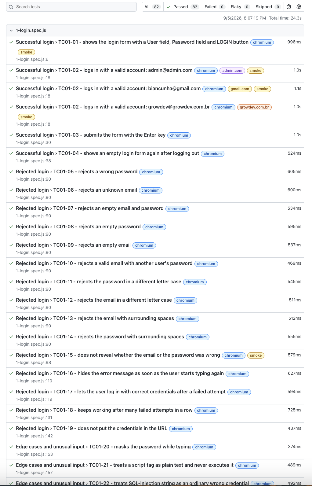
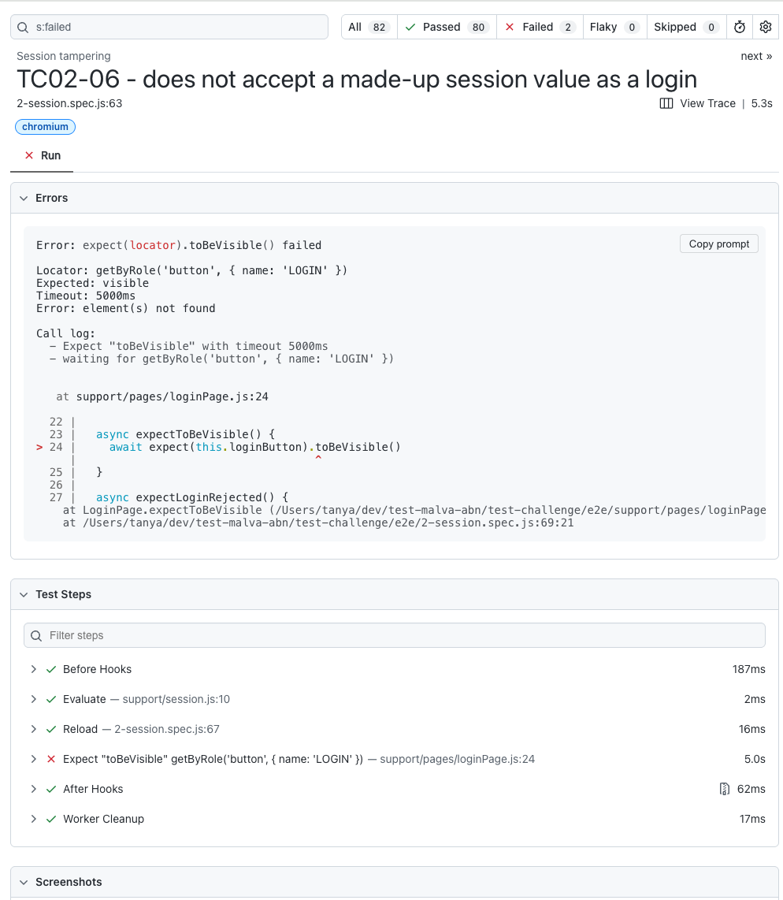

# Login test automation

[](https://github.com/TetianaMalva/qa-web-assignment/actions/workflows/tests.yml)

Automated tests for the login of a small Vue 3 app. Playwright, JavaScript, three browsers, GitHub Actions.

- [ASSIGNMENT.md](docs/ASSIGNMENT.md) - the original task
- [TEST-STRATEGY.md](docs/TEST-STRATEGY.md) - what is tested and why
- [TEST-REPORT.md](docs/TEST-REPORT.md) - results, traceability and bugs found

## Run it

Node 22 or newer.

```bash
npm ci
npx playwright install
npx playwright test
```

Playwright builds the app and serves it itself. Nothing else needs to be started.

```bash
npm run test:smoke           # 5 quick tests in Chromium
npx playwright test --ui     # step through the tests
npx playwright show-report   # HTML report of the last run
npm run lint                 # eslint and prettier
npm test                     # the unit test that came with the app
```

To run against a deployed app, set `BASE_URL` (see `.env.example`).

## What a run looks like




## Good to know

**Seven tests per browser show `✘` and the run is still green.** They are known bugs, marked with
`test.fail()`. When a bug is fixed, its test passes, the run goes red, and the marker is removed on purpose.



**The logged-in page has one accepted axe violation** (Logout button contrast, BUG-4). The test checks
that it is the only one, so a new violation still fails.

**The users are in the source code and in the bundle.** The task says so. It is still written down as BUG-6.

## Design choices

- The production build is under test (`vite build` and `vite preview`), not the dev server.
- Session tests log in through the real form. Seeding `localStorage` would only work because of BUG-3.
- Known bugs stay as running tests, not skipped ones, so the suite notices when they are fixed.
- CI runs lint, the unit test and smoke tests first. The full suite in Chromium, Firefox and WebKit runs only when that is green. A nightly run catches browser updates.
- The suite was checked against a broken app once, by hand. See the test report.

## Structure

```
playwright.config.js     browsers, reporters, app server
e2e/
  1-login.spec.js
  2-session.spec.js
  3-accessibility.spec.js
  4-responsive.spec.js
  5-storage-blocked.spec.js
  support/
    fixtures.js          fresh login page, logged-in page, console capture
    pages/               page objects
    testData.js          accounts from js/users.js, edge-case input
    session.js           read, write and block the localStorage session
docs/                    task, test strategy, test report, media
```
