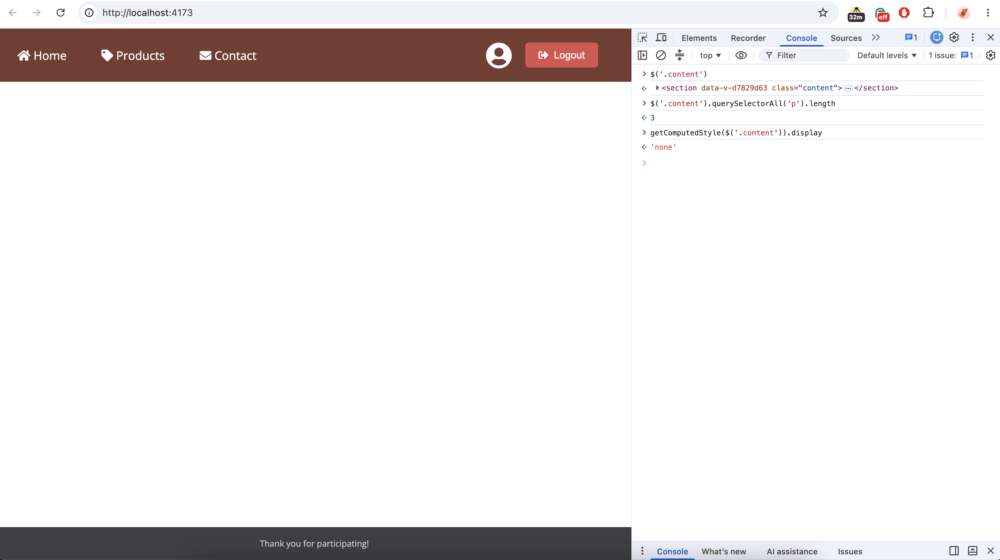
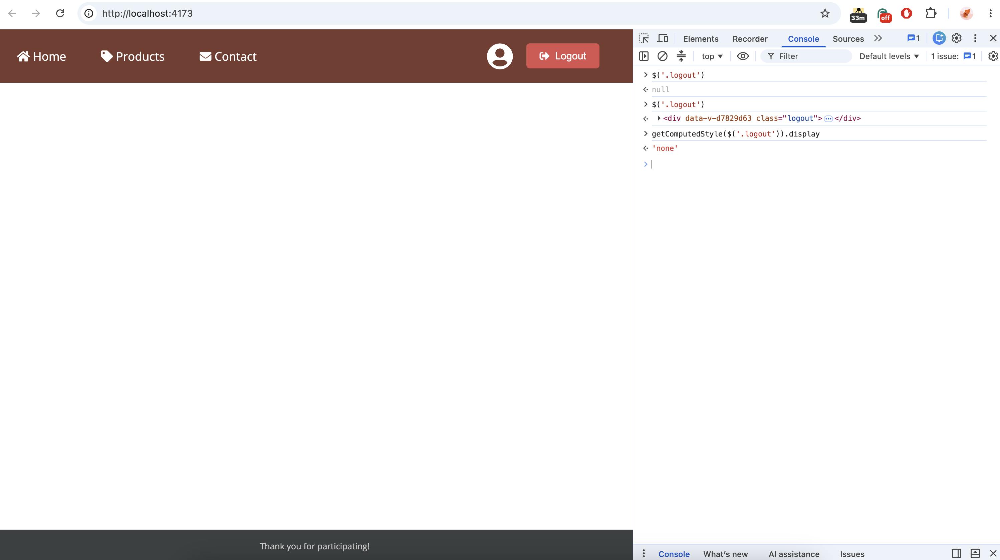
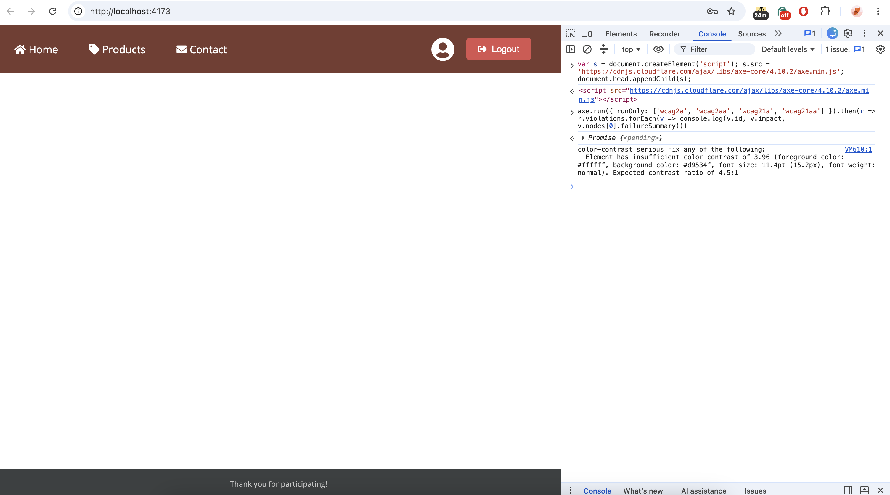
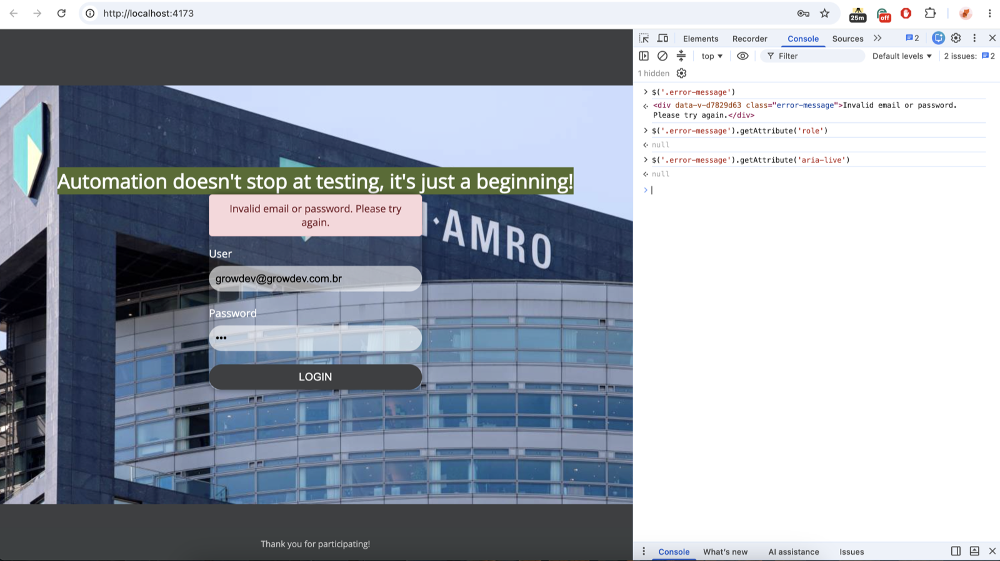
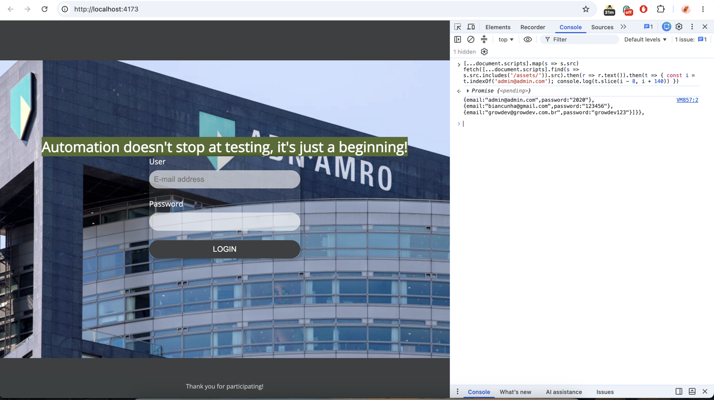
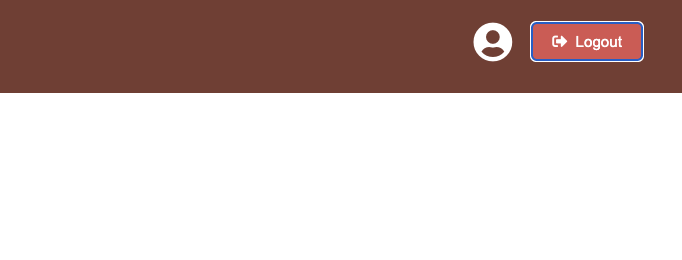
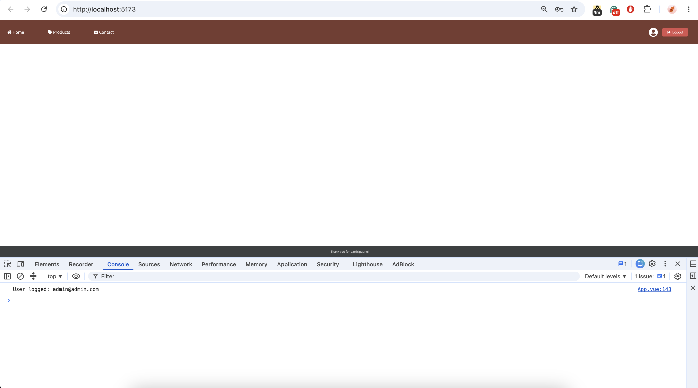
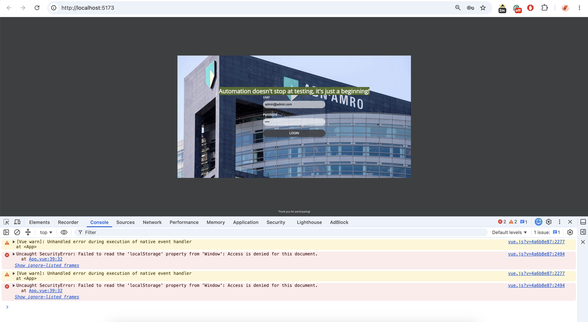

# Test Report

**Tested:** Login functionality of the Vue 3 application, version 1.1.1.

**Test run** 6 September 2026, Chromium and Firefox, local environment. WebKit runs in CI only.

The same suite runs in GitHub Actions on every pull request, push to `master` and nightly. Each CI run has its own test report.

## 1. Result

**Not releasable.**: is blocked by BUG-1, BUG-2, BUG-3, BUG-6, BUG-9.

## 2. Test Results

The suite was executed against Chromium and Firefox.

- 48 tests, 2 browsers, 96 runs, 28 seconds
- 82 passed
- 14 expected failures: the seven known defects with a test, marked with `test.fail()` (once per browser)
- 0 unexpected failures, 0 flaky, 0 skipped

### Proving the tests can fail

A suite that is always passed proves nothing, so I checked it against a broken application.
In `src/App.vue` I replaced the credential check with `const user = this.users[0]`, so any input logs in as the first user and ran the suite in Chromium:

- 24 of 48 tests failed, 24 passed
- every rejected-login test failed (TC01-05 to TC01-19), because the error message never appeared
- two of the three valid-account tests failed (TC01-02 for the second and third user), because the session held the wrong email
- TC02-08 failed, because the stored session was the first user, not the one who logged in
- the edge-case tests TC01-21 to TC01-25 failed , because the error message never appeared

The file was restored afterwards; the application source in the repository is unchanged.

## 3. Traceability

`README-Vue.md` is the main requirements source. The assignment also adds edge-case and accessibility requirements.

| Requirement                                     | Tests                                | Bugs         |
| ----------------------------------------------- | ------------------------------------ | ------------ |
| Login with predefined users                     | TC01-01 to TC01-25                   |              |
| Session stored in `localStorage`                | TC02-01 to TC02-03, TC02-06, TC02-08, TC01-25 | BUG-3 |
| Session when storage is blocked                 | TC05-01 to TC05-03                   | BUG-9        |
| Navigation bar with menu items and user profile | TC02-05, TC02-07, TC03-07            | BUG-2, BUG-7 |
| Responsive, mobile-friendly layout              | TC04-01, TC04-02                                   |
| Logout via dropdown menu                        | TC02-02, TC02-05                     | BUG-2        |
| Edge cases                                      | TC01-20 to TC01-25                   |              
| Accesibility                                   | TC03-01 to TC03-07                   | BUG-4, BUG-5, BUG-7 |
| Console output                                  | TC01-25, TC02-09                     | BUG-8        |

## 4. BUGS

| ID | Title | Severity | Test |
| --- | --- | --- | --- |
| BUG-1 | Main page content is invisible after login | High | TC02-04 |
| BUG-2 | Sign Out in the user menu cannot be used | Medium | TC02-05 |
| BUG-3 | Any value in localStorage is accepted as a valid session | High, security | TC02-06 |
| BUG-4 | Logout button fails WCAG AA contrast requirement | Low | TC03-02 |
| BUG-5 | Login error is not announced to screen readers | Medium | TC03-05 |
| BUG-6 | User accounts and authentication logic are exposed in the browser | Security, by design | none |
| BUG-7 | User menu cannot be reached with the keyboard | Medium | TC03-07 |
| BUG-8 | Logged-in email is written to the browser console | Low | TC02-09 |
| BUG-9 | Login silently does nothing when browser storage is blocked | Medium | TC05-03 |

Each defect has a `test.fail()` test that asserts the expected behaviour, so the build is passed
now and failed as soon as the defect is fixed.

### BUG-1: Main page content is invisible after login

- **Severity:** High
- **Area:** Logged-in screen
- **Test:** TC02-04 in `e2e/2-session.spec.js`

**Steps to reproduce:**

1. Open the application.
2. Log in with `growdev@growdev.com.br` / `growdev123`.
3. Check the area between the navigation bar and footer.

**Actual result:** The navigation bar and footer are visible, but the main content is hidden. The three paragraphs are present in the DOM but have `display: none`.

**Expected result:** The main content should be visible after login.

**Cause:** The stylesheet still contains `.content { display: none }` from the previous implementation. The old `js/index.js` changed this value manually, but `App.vue` does not override it.

**Suggested fix:** Change `.content { display: none }` to `display: flex` in `css/style.css`.

**Attachments:**


---

### BUG-2: Sign Out in the user menu cannot be used

- **Severity:** Medium
- **Area:** Logged-in screen, user menu
- **Test:** TC02-05 in `e2e/2-session.spec.js`

**Steps to reproduce:**

1. Log in.
2. Click the user icon in the navigation bar.

**Actual result:** The dropdown is added to the DOM but remains hidden with `display: none`, so Sign Out cannot be selected.

The separate Logout button still works, so there is a workaround.

**Expected result:** The user menu should open and contain a working Sign Out option.

**Cause:** The stylesheet expects the old script to add an `active` class:

```css
.logout.active { display: flex }
```

`App.vue` uses `v-if` instead and does not add the class.

**Suggested fix:** Remove `display: none` from `.logout` because `v-if` already controls whether the element is rendered.

**Attachments:**



---

### BUG-3: Any value in `localStorage` is accepted as a valid session

- **Severity:** High security concern
- **Area:** Authentication
- **Test:** TC02-06 in `e2e/2-session.spec.js`

**Steps to reproduce:**

1. Open the application without logging in.
2. Open the browser console.
3. Run `localStorage.logged = 'anything'`.
4. Reload the page.

**Actual result:** The logged-in screen is displayed even though no valid login occurred.

**Expected result:** An invalid session value should be rejected and the login form should remain visible.

**Cause:** The application checks only:

```js
!!localStorage.getItem('logged')
```

Any non-empty value is therefore treated as a valid session. The value is not validated against a user or protected by a server-side authentication mechanism.

**Suggested fix:** This cannot be properly fixed within the current client-only implementation. In a real application, authentication should be handled by a backend using a proper session or token with an expiry.

**Attachments:**


---

### BUG-4: Logout button fails WCAG AA contrast requirement

- **Severity:** Low
- **Area:** Accessibility, logged-in screen
- **Test:** TC03-02 in `e2e/3-accessibility.spec.js`

**Steps to reproduce:**

1. Log in.
2. Run an axe accessibility scan.

**Actual result:** The Logout button has a contrast ratio of 3.96:1. Axe reports a `color-contrast` violation.

**Expected result:** Text should meet the WCAG AA minimum contrast ratio of 4.5:1.

**Suggested fix:** Use the existing `#c9302c` colour as the default background.

**Attachments:**



---

### BUG-5: Login error is not announced to screen readers

- **Severity:** Medium
- **Area:** Accessibility, login form
- **Test:** TC03-05 in `e2e/3-accessibility.spec.js`

**Steps to reproduce:**

1. Open the application with a screen reader.
2. Enter a valid email and incorrect password.
3. Submit the form.

**Actual result:** The error appears visually but is not announced by the screen reader.

**Expected result:** The error should be announced when it appears

**Cause:** The error message is plain `<div>` without an ARIA role or live region. This is not detected by the current axe rules.

**Suggested fix:** Add `role="alert"` to the error message.
**Attachments:**



---

### BUG-6: User accounts and authentication logic are exposed in the browser

- **Severity:** Security concern
- **Area:** Authentication
- **Test:** Not automated

**Steps to reproduce:**

1. Open the application.
2. Open browser developer tools.
3. Open the application bundle.
4. Search for `admin@admin.com`.

**Actual result:** The user emails and passwords are available in the browser source.

The accounts are included in `App.vue` and are also available through `js/users.js`. The credential comparison is performed entirely in the browser.

**Expected result:** In real application, credentials should not be sent to the browser and authentication should be handled by backend.

**Reason it is not fixed here:** The assignment requires the users to be provided in `users.js`, so this is limitation of the current exercise rather than a client-side fix.

BUG-3 is a direct consequence of the same client-side authentication approach.

**Attachments:**



---

### BUG-7: User menu cannot be reached with the keyboard

- **Severity:** Medium
- **Area:** Accessibility, logged-in screen
- **Test:** TC03-07 in `e2e/3-accessibility.spec.js`

**Steps to reproduce:**

1. Log in.
2. Press `Tab` repeatedly.

**Actual result:** Focus goes to the Logout button and then leaves the page. The user icon never receives focus, so the dropdown behind it cannot be opened without a mouse.

**Expected result:** Every control in the navigation bar can be reached and activated with the keyboard (WCAG 2.1.1).

**Cause:** The user icon is a `<div class="user-section">` with a click handler. A `div` is not focusable and has no role.

**Suggested fix:** Make it a `<button type="button" aria-label="User menu" aria-expanded="...">`.

**Attachments:** TC03-07 collects the focused elements after six `Tab` presses; `user-section` is never among them. axe does not report this because it is a missing element, not a wrong one.



---

### BUG-8: Logged-in email is written to the browser console

- **Severity:** Low
- **Area:** Authentication, privacy
- **Test:** TC02-09 in `e2e/2-session.spec.js`

**Steps to reproduce:**

1. Open the browser console.
2. Log in, or reload the page while logged in.

**Actual result:** The console shows `User logged: <email>`.

**Expected result:** No personal data in the console of prod build.

**Attachments:**



---

### BUG-9: Login silently does nothing when browser storage is blocked

- **Severity:** Medium
- **Area:** Authentication
- **Test:** TC05-03 in `e2e/5-storage-blocked.spec.js`

**Steps to reproduce:**

1. Block site data for the application (for example Firefox: Settings, Privacy, Cookies and Site Data, Manage Exceptions, Block), or run TC05-02.
2. Open the application and log in with valid credentials.

**Actual result:** Nothing happens. The form stays filled in, no error is shown, the button can be pressed again with the same result. Only the developer console shows the exception.

**Expected result:** The user is told that the login could not be completed.

**Cause:** `logIn()` calls `localStorage.setItem` without a `try`/`catch`. When storage is blocked the call throws and the error handling is skipped.

**Suggested fix:** Wrap the storage calls in `try`/`catch` and set `errorMessage` when they fail.

**Attachments:** TC05-02 pins the current behaviour, TC05-03 is the expected-failure test for the fix.



## 5. Repository Notes

### Lockfile

`package-lock.json` originally referenced an internal Nexus registry, which caused `npm ci` to fail outside that network, including in GitHub Actions.

The lockfile was regenerated using the public npm registry.

The original lockfile remains in the Git history.

### Unused files

`js/index.js` and `index-vue.html` are not referenced by the current application.

They were left unchanged because they are application files and removing them is outside the scope of the test work.

`js/users.js` is retained because it is required by the assignment and is used as the source of test data.


